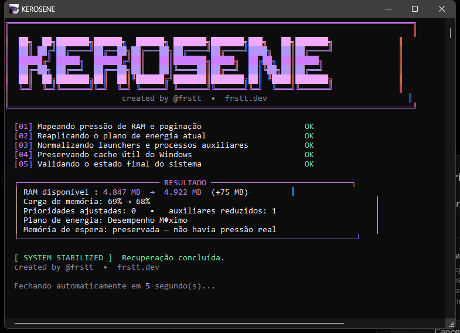

<div align="center">


# KEROSENE

`created by @frstt` · [GitHub @frsttw](https://github.com/frsttw) · [frstt.dev](https://frstt.dev)

<br>


**Recupere a responsividade do Windows depois de sessões pesadas de jogo.**

</div>

---

<div align="center">



</div>

## Sobre

Kerosene é um utilitário portátil para Windows que analisa o estado do sistema, aplica ajustes conservadores e fecha automaticamente. Basta abrir o executável quando quiser recuperar a fluidez do computador.

O aplicativo não usa internet, não instala serviços, não fecha seus programas e não apaga arquivos, caches ou dados pessoais.

## O que ele faz

```text
[01] Mapeia a pressão de RAM e paginação
[02] Reaplica o plano de energia que já está ativo
[03] Normaliza launchers e processos auxiliares conhecidos
[04] Preserva o cache ou libera standby somente sob pressão real
[05] Valida o estado final e fecha automaticamente
```

- Mede a RAM física disponível e a carga de memória.
- Reaplica somente o plano de energia atual, sem usar configurações específicas de uma máquina.
- Normaliza prioridades elevadas de launchers conhecidos.
- Reduz o working set apenas de auxiliares pesados e sem janela ativa.
- Libera a memória standby somente quando a carga atinge 80% ou a disponibilidade cai abaixo da reserva adaptativa.
- Salva o relatório mais recente em `%LOCALAPPDATA%\Kerosene\last-run.log`.

## Segurança

O Kerosene foi projetado para agir de maneira previsível e reversível:

- não fecha navegadores, documentos, jogos ou aplicativos de trabalho;
- não apaga arquivos temporários nem caches de jogos;
- não cria alterações permanentes no Registro;
- não instala serviços ou componentes em segundo plano;
- não força um plano de energia diferente;
- não executa limpeza agressiva de memória.

## Usar

Baixe ou compile `dist\Kerosene.exe` e execute o arquivo. O Windows solicitará permissão administrativa porque algumas APIs de gerenciamento de memória exigem elevação.

O painel executa todo o processo sem interação e fecha sozinho após a conclusão.

## Compilar

Requisitos: Windows 10 ou 11 com .NET Framework 4.x.

```powershell
powershell -ExecutionPolicy Bypass -File .\build.ps1
```

O executável será criado em `dist\Kerosene.exe` com:

- plataforma `AnyCPU`;
- manifesto administrativo incorporado;
- ícone oficial multirresolução;
- metadados de produto e autoria.

## Estrutura

```text
Kerosene/
├── assets/              # Arte original e ícone do aplicativo
├── dist/                # Executável portátil
├── docs/                # Imagens da documentação
├── src/Kerosene.cs      # Fonte canônica
├── build.ps1            # Build pelo compilador do .NET Framework
├── Kerosene.csproj      # Projeto .NET Framework 4.8
└── Kerosene.manifest    # Elevação e compatibilidade do Windows
```

## Licença e créditos

Distribuído sob a licença MIT.

**Kerosene — created by @frstt · [GitHub @frsttw](https://github.com/frsttw) · [frstt.dev](https://frstt.dev)**
