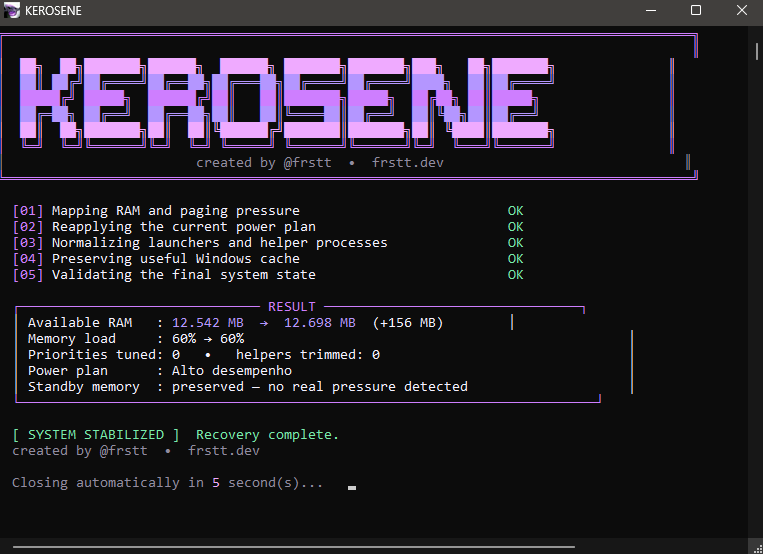

<div align="center">


# KEROSENE

`created by @frstt` · [GitHub @frsttw](https://github.com/frsttw) · [frstt.dev](https://frstt.dev)

<br>


**Recover Windows responsiveness after demanding gaming sessions.**

</div>

---

<div align="center">



</div>

## Overview

Kerosene is a portable Windows utility that analyzes system state, applies conservative adjustments, and closes automatically. Run the executable whenever you want to restore system responsiveness.

The application does not use the internet, install services, close your programs, or delete files, caches, or personal data.

## What it does

```text
[01] Maps RAM and paging pressure
[02] Reapplies the power plan that is already active
[03] Normalizes known launchers and helper processes
[04] Preserves cache or releases standby memory only under real pressure
[05] Validates the final state and closes automatically
```

- Measures available physical RAM and memory load.
- Reapplies only the current power plan without machine-specific settings.
- Normalizes elevated priorities for known launchers.
- Reduces the working set only for heavy helpers without an active window.
- Releases standby memory only when load reaches 80% or availability falls below the adaptive reserve.
- Saves the latest report to `%LOCALAPPDATA%\Kerosene\last-run.log`.

## Safety

Kerosene is designed to behave predictably and reversibly:

- does not close browsers, documents, games, or work applications;
- does not delete temporary files or game caches;
- does not create permanent Registry changes;
- does not install services or background components;
- does not force a different power plan;
- does not perform aggressive memory cleanup.

## Usage

Download or build `dist\Kerosene.exe` and run it. Windows requests administrator permission because some memory-management APIs require elevation.

The panel runs the entire process without interaction and closes by itself when it finishes.

## Build

Requirements: Windows 10 or 11 with .NET Framework 4.x.

```powershell
powershell -ExecutionPolicy Bypass -File .\build.ps1
```

The executable is created at `dist\Kerosene.exe` with:

- `AnyCPU` platform;
- embedded administrator manifest;
- official multi-resolution icon;
- product and authorship metadata.

## Estrutura

```text
Kerosene/
├── assets/              # Original artwork and application icon
├── dist/                # Executável portátil
├── docs/                # Documentation images
├── src/Kerosene.cs      # Fonte canônica
├── build.ps1            # Build pelo compilador do .NET Framework
├── Kerosene.csproj      # Projeto .NET Framework 4.8
└── Kerosene.manifest    # Windows elevation and compatibility
```

## License and credits

Distributed under the MIT License.

**Kerosene — created by @frstt · [GitHub @frsttw](https://github.com/frsttw) · [frstt.dev](https://frstt.dev)**
